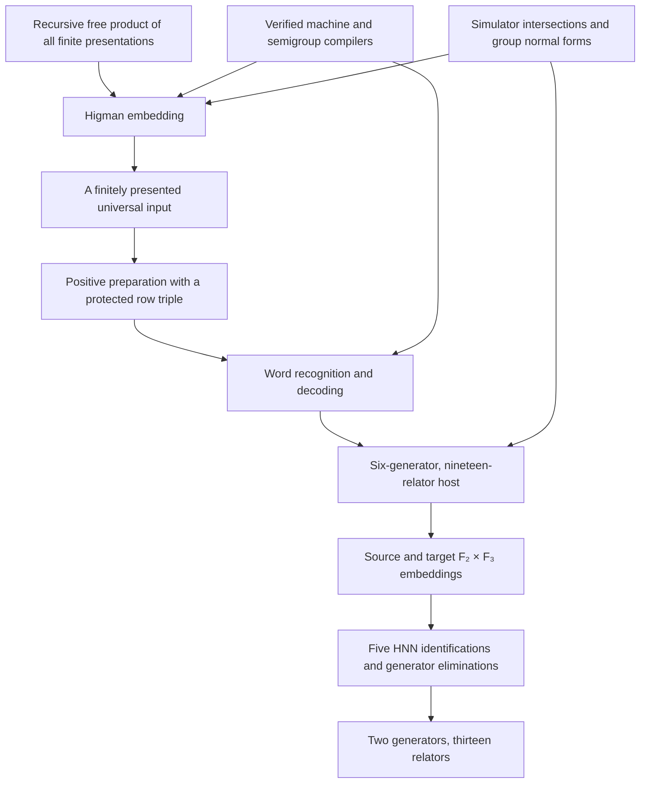

# Proof structure

[UniversalGroup.lean](UniversalGroup.lean) proves that a presentation with
two generators and thirteen relators defines a group containing
every finitely presented group. The target is chosen before quantifying over
the input presentations.

## Construction overview

[Universality.lean](UniversalGroup/Embedding/Universality.lean) composes the embeddings
using one universal input and a recognition datum for its prepared presentation.
The compiler, simulator, and normal-form results are proved within the library
and its pinned Mathlib dependencies.

## The universal finitely presented input

[Enumeration](UniversalGroup/Higman/Enumeration.lean) enumerates finite presentations
and uses a disjoint set of generators for each. Their free product has a
recursive presentation, and each finitely presented group embeds as a factor.
An [effective two-generator embedding](UniversalGroup/Higman/EffectiveEmbedding/HNN.lean)
reduces this recursive presentation to two specified generators using free
conjugate families and a proper HNN extension.

The formal [Higman theorem](UniversalGroup/Higman/Theorem.lean) embeds this group
in a finitely presented group. Its proof uses a
[signed positive cover](UniversalGroup/Higman/SignedCover.lean), a verified
finite recognizer, and [benign subgroup embeddings](UniversalGroup/Higman/Benign.lean).
Positive spellings of generators and inverses ensure that the positive
nullwords generate the relevant kernel as a subgroup. Exact simulator
intersections and centralizer HNN normal forms then supply the required benign
quotients. This produces the single universal finite input used below.

## Positive preparation and the protected row triple

The input embeds in a positive two-generator presentation `G`. The preparation
uses reflection extensions, an order-four element, and a free subgroup of
`C₄ * C₄`. It retains positive spellings for inverses and an integer character
proving both designated generators have infinite order.

The additional requirement concerns the actual row presentation
`rowPresentation G`:

\[
R_G=\langle b,c\mid R_G^{\mathrm{input}}
 (b^2cb^{-2},b^{-1}cb)\rangle.
\]

Here the relators are those of `G`, after the displayed substitution.
`ProtectedRowTriple G` asserts that `(b,cbc⁻¹,c³)` freely generate in this
quotient, not merely in the free group on `b,c`.
[RowModel.lean](UniversalGroup/Embedding/ProtectedInput/RowModel.lean) compares it
with the proper HNN extension of `U = (⟨c⟩ * G) * ⟨ell⟩` identifying
`(u,ell,c)` with `(ell,c,v)`.

The [protected preparation theorem](UniversalGroup/Embedding/ProtectedInput/Theorem.lean)
uses a marked quotient and an explicit action:

- [MarkedQuotient.lean](UniversalGroup/Embedding/ProtectedInput/MarkedQuotient.lean)
  strengthens the positive preparation to retain a map with any prescribed
  generator images `u,v` satisfying `(u*v)²=1`, alongside the input
  embedding.
- [ProtectedAction.lean](UniversalGroup/Embedding/ProtectedInput/ProtectedAction.lean)
  constructs permutations of `Fin 4 × H`, where `H` is an auxiliary proper HNN
  extension, satisfying `(c*b⁻³*c*b³)²=1`. The triple `b,cbc⁻¹,c³` fixes one
  state label and acts there by three free translations in `H`.
- Taking `u=b²cb⁻²` and `v=b⁻¹cb` makes `u*v` conjugate to `c*b⁻³*c*b³`.
  The marked map therefore induces a map out of `R_G` detecting its free triple.

The input embedding and the map detecting the free triple serve separate purposes.
This marked-map argument provides the protected triple without a
small-cancellation or Greendlinger theorem.

## Recognition and the positive host

The [coding interface](UniversalGroup/Coding/Data.lean) distinguishes positive
monoid equality from equality in the group completion. A `ValievDatum` records
both recognition of positive nullwords `w ≡ []` by `code(w)*P ≡ P` and literal
decoding of every positive prefix `v` satisfying `v*P ≡ P`. Here `≡` denotes
equality in the respective presented monoids; prefix decoding concludes the
list equality `v=code(w)`. Source markers, the Boone–Collins binary substitutions,
and priority normalization establish these properties.

The simulator uses the rank-five freeness, subgroup intersections, and exact
single-letter subgroup presentations recorded in Kegel–Li–Ren,
Propositions 3.3–3.4, Lemma 3.5, and Corollaries 3.6–3.7 (see
[References](#references)). Their Propositions 3.3–3.4 are attributed to
Borisov's Assertions IV–V. Here these structural results are proved for every
[SupportedRules](UniversalGroup/Simulator/Core/SupportedRules.lean) datum:
three pairs of positive rule words containing both letters, with power
exponent four. The proofs are in
[FreeBasis.lean](UniversalGroup/Simulator/Core/FreeBasis.lean),
[BaseIntersections.lean](UniversalGroup/Simulator/Core/BaseIntersections.lean),
[IntersectionsTransport.lean](UniversalGroup/Simulator/Core/IntersectionsTransport.lean),
and [Symmetry.lean](UniversalGroup/Simulator/Core/Symmetry.lean).
This is the structural input needed for the positive symmetry;
Kegel–Li–Ren's nine-relator undecidability theorem is not an input.

The host also adapts the first HNN symmetry in Kegel–Li–Ren, Section 3,
proof of Lemma 2.2 using Lemma 3.1. After changing coordinates, this construction
uses a positive-sign variant that interchanges `d` and `E₀=f⁻¹*e*f`, and extends
the symmetry to fix the input group and `ell`.

The simulator `L : FP 7 13` is compared with a faithful HNN model, and
`K : FP 8 16` centralizes the subgroup `D=⟨c,d,T⟩`. The
[intersection theorem](UniversalGroup/Simulator/Intersections.lean) proves the
exact recognition equalities `D ∩ A = R` and `D ∩ B = R` using reduced words
and signed-code cancellation.

The centralizing amalgam `K *_[V] (V × G)` embeds both factors. The `ell`
extension contains `U × F(x₀,x₁,x₂,x₃)`. The positive simulator symmetry
interchanges `d` and `E₀=f⁻¹*e*f`; its stable letter `h` consequently satisfies
`[d,h²]=1`. Exact attaching-subgroup intersections preserve
`U × F(x₀,x₁,h,x₃)` through this extension. The `a` shift gives
`U × F(a,x₀)`, and the `b` extension carries out the row identifications.
[Model comparison](UniversalGroup/Embedding/PositiveHost/ModelComparison.lean)
verifies all nineteen defining relations;
[InputEmbedding.lean](UniversalGroup/Embedding/PositiveHost/InputEmbedding.lean)
constructs `PositiveHost.InputEmbedding.embedding` in the resulting six-generator
host. The final assembly uses this embedding directly; `baseInputHom_generator`
records its specified generator images.

The stable-letter convention throughout is `z^h=h⁻¹*z*h`. In particular,
`f^h=f⁻¹*t`, so `t=f*h⁻¹*f*h`. The recovered words are
`ell=b*c*b⁻¹`, `u=b²*c*b⁻²`, `v=b⁻¹*c*b`, and `x=k⁻¹*f*k`.

## The two product-subgroup embeddings

The source is `F(c,d) × F(f,k,h²)`.
[SourceFree.lean](UniversalGroup/Embedding/PositiveHost/SourceFree.lean) proves
that `(f,fʰ,h²)` freely generate a subgroup of `F(f,h)` using a two-state
action. An exponent map proves `⟨f,h²⟩ ∩ ⟨f*fʰ⟩ = 1`. Restricting the
centralizer HNN `⟨f,h,k | [k,f*fʰ]=1⟩` then proves freeness of `f,k,h²`.
A [quotient of the positive h-stage](UniversalGroup/Embedding/PositiveHost/SourceQuotient.lean)
detects that triple while killing `c,d`. The simulator embeds `F(c,d)`,
and all cross-commutations hold, proving the full product embeds.

The target is `F(a,x) × F(A,B,b)`, where `B=cbc⁻¹` and `A=Bc³B⁻¹`.
[RowProduct.lean](UniversalGroup/Embedding/ProtectedInput/RowProduct.lean)
reflects both attaching subgroups to embed the entire row HNN group through
the final `b` extension. Normal forms show that a row word whose image lies
in the ambient base already lies in the row base. The previously established
direct-product embedding then proves that the row group meets the column factor
trivially. Since they
commute, `R_G × F(a,x)` embeds. The change of free basis
`(b,B,c³) ↦ (Bc³B⁻¹,B,b)` supplies the target triple.

[AttachingMaps.lean](UniversalGroup/Embedding/AttachingMaps.lean) transfers both
product embeddings to the presented host group with the specified images
of the basis elements.

## Compression to thirteen relators

One new HNN letter `r` identifies the five basis elements:

\[
c^r=a,\quad d^r=x,\quad f^r=A,\quad k^r=B,\quad(h^2)^r=b.
\]

Put `a=r⁻¹cr`, `J=r⁻²c²r²`, and `b=J⁻¹c⁶J`; then eliminate
`k=rBr⁻¹`, `f=rBc³B⁻¹r⁻¹`, and `d=r²c³r⁻²`.
Four cross-commutators and `[d,h²]` follow from the retained relations.
The recovered word for `b` and `[c,a]` also imply `[a,b]`. Thus

\[
(6+1)-5=2\text{ generators},\qquad(19+5)-5-6=13\text{ relators}.
\]

[CompressionIdentities.lean](UniversalGroup/Embedding/CompressionIdentities.lean) checks the eliminations
and deletions in an arbitrary group.
[Presentations.lean](UniversalGroup/Embedding/Presentations.lean) specifies the
explicit `FP 2 13` presentation by substituting into the host relators with
zero-based indices `0,1,2,3,4,5,6,7,8,9,11,16,18`.
[FactorSwap.lean](UniversalGroup/Embedding/FactorSwap.lean) proves the compression
preserves the host by comparison with the proper HNN extension.

The [references below](#references) identify the historical construction
methods. See [VERIFICATION.md](VERIFICATION.md) for the kernel checks and axiom audit.

## References

The works below provide construction methods, background, and related results.

| Source | Role in this formalization |
| --- | --- |
| G. Higman, B. H. Neumann, and H. Neumann, **Embedding Theorems for Groups**, *Journal of the London Mathematical Society* 24 (1949), 247–254. [Publisher](https://doi.org/10.1112/jlms/s1-24.4.247). | HNN extensions and the two-generator embedding construction. |
| G. Higman, **Subgroups of finitely presented groups**, *Proceedings of the Royal Society A* 262 (1961), 455–475. [Publisher](https://doi.org/10.1098/rspa.1961.0132). | Benign subgroups, the quotient embedding strategy, and the universal finitely presented input. |
| W. W. Boone, D. J. Collins, and Yu. V. Matijasevič, **Embeddings into semigroups with only a few defining relations**, *Studies in Logic and the Foundations of Mathematics* 63 (1971), 27–40. [Publisher](https://doi.org/10.1016/S0049-237X(08)70841-3). | Few-relation semigroup encodings. |
| Yu. Matiyasevich, **Word problem for Thue systems with a few relations**, in *Term Rewriting*, LNCS 909 (1995), 39–53. [Publisher's volume](https://link.springer.com/book/10.1007/3-540-59340-3). | Detailed binary substitutions and priority normalization. |
| W. W. Boone and D. J. Collins, **Embeddings into groups with only a few defining relations**, *Journal of the Australian Mathematical Society* 18 (1974), 1–7. [Publisher](https://doi.org/10.1017/S1446788700019066). | Few-relator group embedding methods and the coding-to-group construction. |
| V. V. Borisov, **Simple examples of groups with unsolvable word problem**, *Mathematical Notes* 6 (1969), 768–775. [Publisher](https://doi.org/10.1007/BF01101402). | Simulator core, Assertions IV–V, and subgroup normal forms. |
| M. Tancer, **Simpler algorithmically unrecognizable 4-manifolds**, arXiv:2310.07421v2 (2025), Appendix A, pp. 25–27. [Versioned preprint](https://arxiv.org/abs/2310.07421v2), [PDF](https://arxiv.org/pdf/2310.07421v2). | Adjustments to Borisov’s Assertions IV–V and Lemma 4 for general admissible power exponents; background for the simulator normal-form arguments. |
| M. K. Valiev, **Universal group with twenty-one defining relations**, *Discrete Mathematics* 17 (1977), 207–213. [Publisher](https://doi.org/10.1016/0012-365X(77)90153-4). | Recognition and the embedding tower leading to the host construction. |
| M. Kegel, S. Y. Li, and Q. Ren, **Small undecidable groups and unrecognizable 4-manifolds**, arXiv:2609.10461v1 (2026). [Versioned preprint](https://arxiv.org/abs/2609.10461v1), [Lean formalization](https://github.com/32805433/Adian-Rabin). | Propositions 3.3–3.4 (Borisov's Assertions IV–V), Lemma 3.5, and Corollaries 3.6–3.7 supply the simulator subgroup methods. The first HNN symmetry (proof of Lemma 2.2 using Lemma 3.1) is adapted in the host. This library proves the required counterparts for `SupportedRules` and uses a positive-sign variant; the nine-relator undecidability theorem is not used. |

Every embedding and recognition result needed by the final Lean proof is proved
within the library and its pinned Mathlib dependencies. See
[VERIFICATION.md](VERIFICATION.md) for the scope of the kernel and axiom checks.

## Software provenance

Finite-presentation, HNN, simulator, and machine-compilation code was reused
and adapted from the earlier [Adian–Rabin formalization](https://github.com/32805433/Adian-Rabin).
These adaptations are included locally under `UniversalGroup/`; the build
does not depend on an external checkout of that project. Examples include
[PostMachineThue.lean](UniversalGroup/Computability/Machine/PostMachineThue.lean)
and [TM0PostAdapter.lean](UniversalGroup/Computability/Machine/TM0PostAdapter.lean).
A precise upstream revision has not been established. The upstream MIT copyright
notice is retained in [LICENSE](LICENSE).
